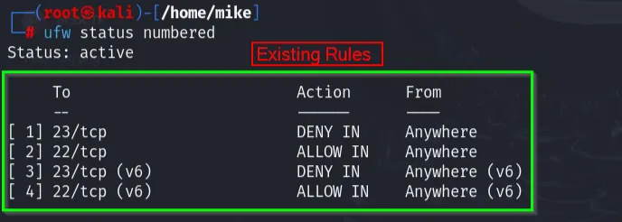
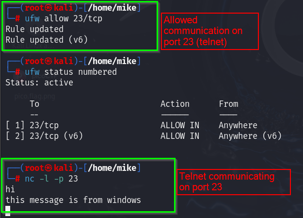

# 🔐 Firewall Configuration Report


**Date:** 01.06.2025

**System Tested:**  Windows, Linux (UFW)

**Firewall Tool Used:**  Windows Defender Firewall, UFW (Uncomplicated Firewall)

---

## 🧭 Objective

Configure and test basic firewall rules to allow or block network traffic using system firewalls on Windows and Linux.

---

## 🖥️ Section A: Linux Firewall Configuration using UFW

### 🔹 1. Show Existing Rules

```bash
sudo ufw status numbered
```

- Confirms if UFW is enabled and lists all rules.

**Screenshot:**

→ 



---

### 🔹 2. Add Rule to Block Inbound TCP Port 23 (Telnet)

```bash
sudo ufw deny 23/tcp
```

**Expected Behavior:**

Telnet on port 23 should be blocked from external sources.

**Screenshot:**

→ 



---

### 🔹 3. Test the Rule

Start a listener:

```bash
sudo nc -l -p 23
```

From another terminal or machine:

```bash
telnet <Host_ip> 23
```

**Expected:**

Connection should fail due to UFW block rule.

**Screenshot:**

→ 


---

### 🔹 4. Allow SSH (Port 22)

```bash
sudo ufw allow 22/tcp
```

**Purpose:**

Ensures SSH access remains open while blocking Telnet.

**Screenshot:**

→ 


---

### 🔹 5. Delete the Test Rule (Restore State)

```bash
sudo ufw delete deny 23/tcp
```

**Screenshot:**

→ 


---

## 🖼️ Section B: Windows Firewall Configuration

### 🔹 1. Show Existing Rules

**Steps:**

- Open `Control Panel → Windows Defender Firewall → Advanced Settings`
- Go to **Inbound Rules**
- Observe existing rules for TCP/port 23

**Screenshot:**

→ 


---

### 🔹 2. Add Rule to Block Inbound Port 23 (Telnet)

**Steps:**

1. In **Inbound Rules**, click **New Rule**
2. Select **Port**, TCP, specific port: `23`
3. Choose **Block the connection**
4. Apply to all profiles
5. Name the rule: `Block Telnet`

**Screenshot:**

→ 5 Steps screenshots.


---

### 🔹 3. Test the Rule

**Method: Same as done for linux.**

- Use `telnet` client or `nc` to connect to port 23.

```powershell

telnet localhost 23
```

**Expected:**

Connection will be refused if rule is applied.

---

### 🔹 4. Delete/Disable the Rule

**Steps:**

- Go to **Inbound Rules**
- Locate `Block Telnet`
- Right-click → Disable or Delete

**Screenshot:**

→ Delete or Disable options highlighted in menu for managing rules.


---

## 🔍 Summary: How Firewalls Filter Traffic

Firewalls inspect packets and apply rules based on:

- Protocol (TCP/UDP)
- Port number
- Direction (Inbound/Outbound)
- IP source/destination

Rules are applied in order and can be:

- **Allow** – permits traffic
- **Deny** – blocks traffic
- **Default Policy** – fallback behavior (deny by default in UFW)

**Use Cases:**

- Block unused services like Telnet (port 23)
- Allow secure services like SSH (port 22)
- Protect against unauthorized access attempts